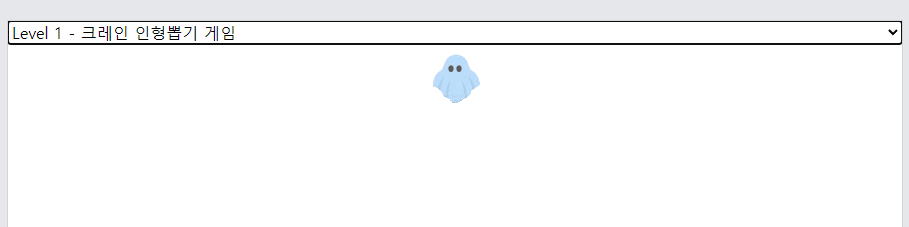

# 주제
+ 프로그래머스 문제 설명 및 풀이 방법 설명
+ chatAPI를 이용한 프로그래머스 코딩테스트 문제 해결방법 설명

# 배포주소
+ https://beerbank3.github.io/Ormi_chatGPT_project/

# 목표
+ HTML, JS, CSS 활용하기

# 기능
+ select box로 원하는 문제 선택
+ chat으로 추가적인 궁금한점 질문가능

# 사용예제

> 메인화면입니다. 왼쪽은 문제선택시 문제 설명하는 칸,
> 오른쪽은 그 문제에 대한 질의응답 칸입니다.

> 문제 선택시 로딩중인걸 알려주는 gif입니다.

> 문제 선택시 문제에 대한 설명과 해결방안을 알려줍니다.

> 문제에 대한 질의응답을 하면 답변이 나옵니다.

